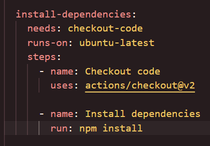
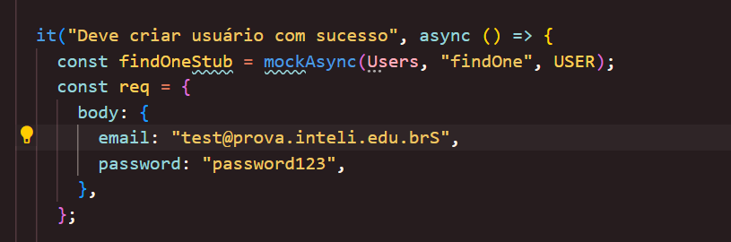
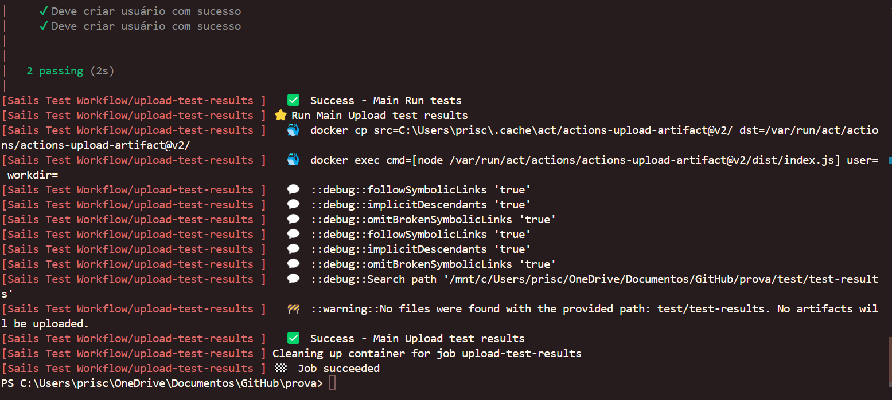

# petbook-aula

a [Sails v1](https://sailsjs.com) application

### Links

+ [Sails framework documentation](https://sailsjs.com/get-started)
+ [Version notes / upgrading](https://sailsjs.com/documentation/upgrading)
+ [Deployment tips](https://sailsjs.com/documentation/concepts/deployment)
+ [Community support options](https://sailsjs.com/support)
+ [Professional / enterprise options](https://sailsjs.com/enterprise)

### Version info

This app was originally generated on Fri May 10 2024 18:44:02 GMT-0300 (Horário Padrão de Brasília) using Sails v1.5.9.

<!-- Internally, Sails used [`sails-generate@2.0.10`](https://github.com/balderdashy/sails-generate/tree/v2.0.10/lib/core-generators/new). -->

<!--
Note:  Generators are usually run using the globally-installed `sails` CLI (command-line interface).  This CLI version is _environment-specific_ rather than app-specific, thus over time, as a project's dependencies are upgraded or the project is worked on by different developers on different computers using different versions of Node.js, the Sails dependency in its package.json file may differ from the globally-installed Sails CLI release it was originally generated with.  (Be sure to always check out the relevant [upgrading guides](https://sailsjs.com/upgrading) before upgrading the version of Sails used by your app.  If you're stuck, [get help here](https://sailsjs.com/support).)
-->

# Prova

> Este documento tem o objetivo de mostrar o que foi feito na execução da parte prática da prova 2 do módulo 10.

1- Build da aplicação Sails.js: Certifique-se de que a aplicação é compilada corretamente.

2 - Executar Dependabot: Automatize a verificação de atualizações de dependências e a aplicação de patches de segurança.

 </img>

3 - Verificar pacotes: Utilize uma ferramenta para verificar a segurança e a integridade dos pacotes utilizados no projeto.

Correção feita no ci.yml:
 

4 - Testes automatizados: Execute os testes configurados com Mocha e Supertest para garantir que todas as funcionalidades estão funcionando conforme esperado.

Correção feita nos testes:

5 - Confirmação final: Assegure-se de que todas as etapas anteriores foram concluídas com sucesso.

## Passos para resolver a questão:

- Fazer o fork do repositório original:

- Faça o fork do repositório existente para a sua conta do GitHub.

- Link do repositório original: https://github.com/afonsobrandaointeli/projetot3

- Configurar o repositório:

    - Clone o repositório do seu fork.

    - git clone https://github.com/seuusuario/projetot3

Certifique-se de que os testes com Mocha e Supertest estão configurados e funcionando localmente.

- Instalar e configurar o ACT:

- Rode o Act localmente.

- Modificar o workflow existente:

    Abra o arquivo existente do workflow em .github/workflows/ (ex.: ci.yml) e ajuste-o para incluir as novas etapas necessárias.

Instruções Finais

- Certifique-se de que sua aplicação está compilando, instalando os pacotes e testando corretamente com npm test, e que o pipeline está 100% correto. Após realizar todas as modificações e verificações necessárias, envie o link do fork no campo solicitado.

Não esqueça de fazer o COMMIT!
