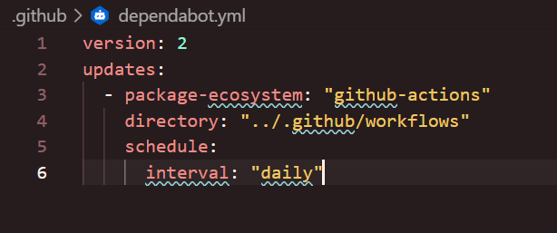

# Prova

> Este documento tem o objetivo de mostrar o que foi feito na execução da parte prática da prova 2 do módulo 10.

1- Build da aplicação Sails.js: Certifique-se de que a aplicação é compilada corretamente.

2 - Executar Dependabot: Automatize a verificação de atualizações de dependências e a aplicação de patches de segurança.

 </img>

3 - Verificar pacotes: Utilize uma ferramenta para verificar a segurança e a integridade dos pacotes utilizados no projeto.

Correção feita no ci.yml:
 

4 - Testes automatizados: Execute os testes configurados com Mocha e Supertest para garantir que todas as funcionalidades estão funcionando conforme esperado.

Correção feita nos testes:

5 - Confirmação final: Assegure-se de que todas as etapas anteriores foram concluídas com sucesso.

## Passos para resolver a questão:

- Fazer o fork do repositório original:

- Faça o fork do repositório existente para a sua conta do GitHub.

- Link do repositório original: https://github.com/afonsobrandaointeli/projetot3

- Configurar o repositório:

    - Clone o repositório do seu fork.

    - git clone https://github.com/seuusuario/projetot3

Certifique-se de que os testes com Mocha e Supertest estão configurados e funcionando localmente.

- Instalar e configurar o ACT:

- Rode o Act localmente.

- Modificar o workflow existente:

    Abra o arquivo existente do workflow em .github/workflows/ (ex.: ci.yml) e ajuste-o para incluir as novas etapas necessárias.

Instruções Finais

- Certifique-se de que sua aplicação está compilando, instalando os pacotes e testando corretamente com npm test, e que o pipeline está 100% correto. Após realizar todas as modificações e verificações necessárias, envie o link do fork no campo solicitado.

Não esqueça de fazer o COMMIT!
